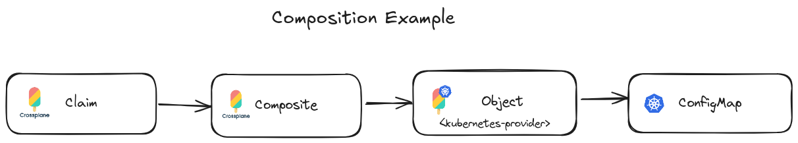
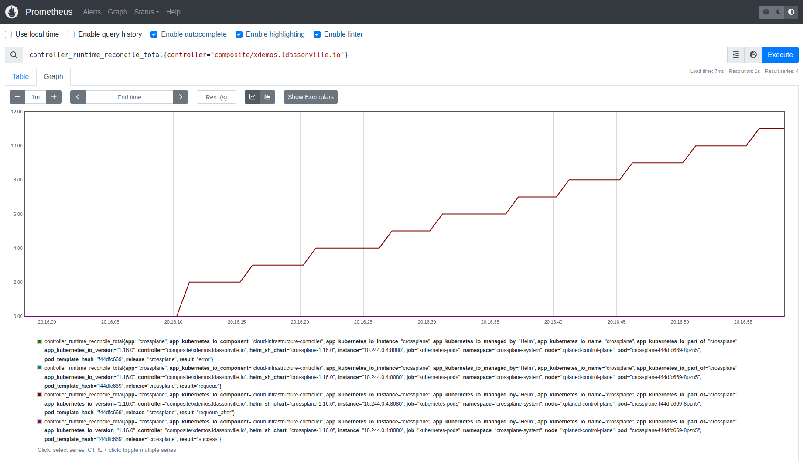
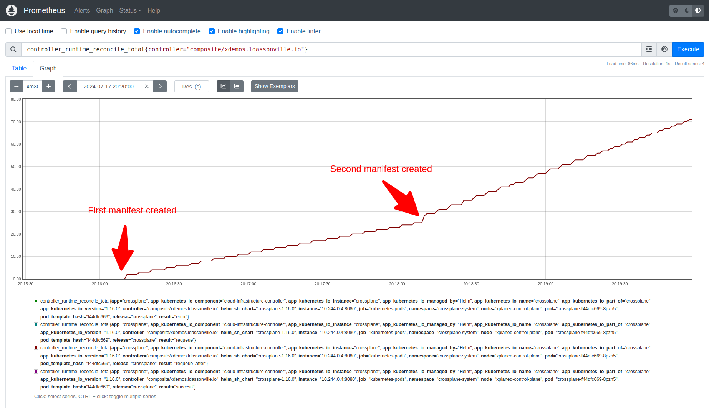
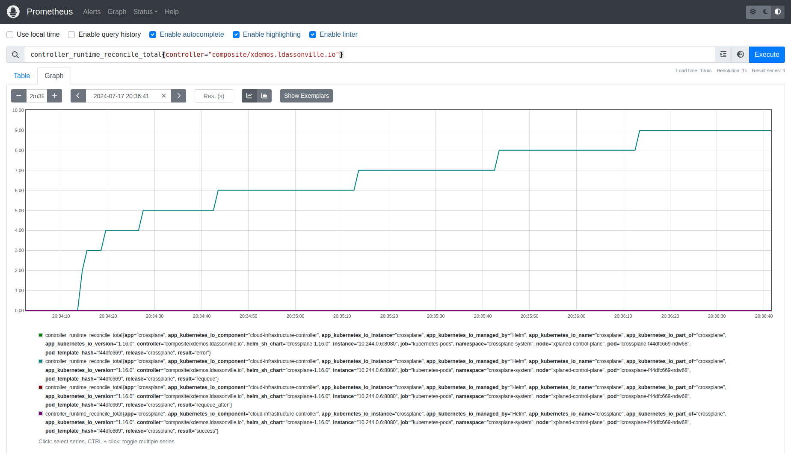
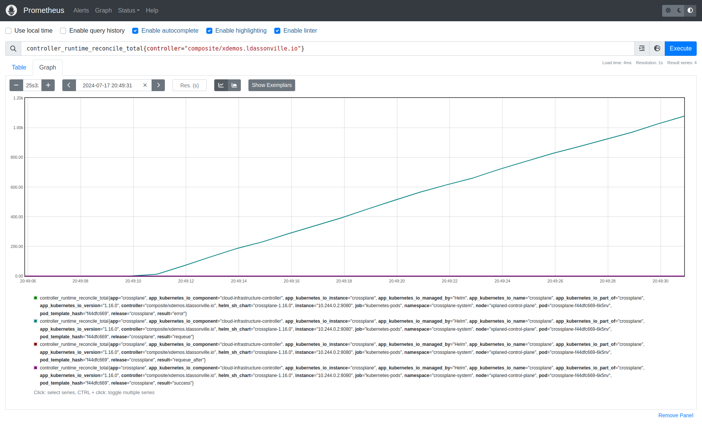

# Poll Interval


Here we will explore the behavior of the [poll-interval](https://github.com/crossplane/crossplane/blob/30cf92b5de42db4adae187f795abf38478300ab6/cmd/crossplane/core/core.go#L97) option


So if we have a look of the help of the parameter use by the command line, it is decribe has follow for the command line

```golang
PollInterval     time.Duration `default:"1m"  help:"How often individual resources will be checked for drift from the desired state."`
```


## Pre-requisis

In order to process to this tutorial, you will need to install your environment like explained [here](./install.md)


## Observe the effect

Note, to observe the reconciliation behavior we will observe the metrics exposed by crossplane using prometheus (in the [install.md](./install.md))


http://localhost:9090/graph?g0.expr=controller_runtime_reconcile_total%7Bcontroller%3D%22composite%2Fxdemos.ldassonville.io%22%7D&g0.tab=0&g0.display_mode=lines&g0.show_exemplars=0&g0.range_input=5m


The observed metrics it the following 

```golang
controller_runtime_reconcile_total{controller="composite/xdemos.ldassonville.io"}
```
This metrics show you the total of reconciliation done for the controller of the composite resource **xdemos.ldassonville.io** that is our demo composite resource.


Tips; to reset your metrics you can use the command

```bash
curl -X POST -g 'http://localhost:9090/api/v1/admin/tsdb/delete_series?match[]={controller="composite/xdemos.ldassonville.io"}'
```


### Nominal case

So we will try to observe the effect of the poll interval by starting a basic case.

In this test we will start by creating a composition that uses the kubernetes provider to create a simple ConfigMap. The advantage of creating a config map it that the resources will be directly ready (no unready period like a pod for example)





So we can execute the command below 

```bash
# Install the XRD
kubectl apply -f manifests/xrd.yaml

# We can validate that the CRD are well generated
kubectl api-resources | grep demo

# Apply the composition 
kubectl apply -f manifests/composition.yaml

# Install a instance of the composition
kubectl apply -f manifests/demo.yaml

```

So since we have configured the poll-interval to 5s crossplane will planified 
the next reconciliation about 5s later. (Keep in mind that the default duration is 1m. We have volontary modified this value to simplify the visualisation of this parameter effects. But of course it's not a good value for production).




So if we create a second resource we can observe that the rate of reconciliation has doubled. 

```bash
# Install a instance of the composition
kubectl apply -f manifests/demo2.yaml
```




### Not ready resource case

Ok for the nominal case when the resources is ready but what if the managed resource isn't in ready status true ? his the behavior will still the same.

To test that we can try to modify our composition to ensure that the managed resource will never be ready.

We will modify the readiness probe with an impossible readiness condition like follow : 

```yaml
spec:
  resources:
    - name: Configmap
      base:
        apiVersion: kubernetes.crossplane.io/v1alpha1
        kind: Object
        spec:
          readiness: 
            policy: DeriveFromCelQuery
            celQuery: "c.Fake == true"

```

Now apply the composition 

```bash
kubectl apply -f manifests/composition-resource-never-ready.yaml
```

This will give us the following graph



So in this case the reconciliation request is requeue after the reconciliation. The queue is configured with and exponential backoff. That why we can observe that the reconciliation is being spaced out more and more unit it reach the max delay.

But that also indicate that in this case the *poll-interval* is not used


### Case resouces Managed can't be created

An other case to verify is when the managed resources can't be created. In the real life in could happen with un unsatisfied patch required for example.

He we will simply create an invalid managed resource to check it, by setting an wrong readiness policy 


```yaml
    - name: Configmap
      base:
        apiVersion: kubernetes.crossplane.io/v1alpha2
        kind: Object
        metadata:
          labels:
            xplaned.io/name: configmap
        spec:
          providerConfigRef:
            name: provider-kubernetes
          readiness: 
            policy: INVALID_POLICY
          # ....
```



So in that case we observe a really high reconciliation rate ?
~1K in less than a minute, but what happen ?

I admit that at this point the behavior was "a little bit disturbing".

When the composition couln't create all his resources, the reconciliation of the resources is imediately triggered and totaly skipping the exponential backoff

As a consequence :
 - the resources CPU is well 
 - the the kubernetes API server is highly solicitated and the 

We will try to explain it in an other article.


But in this case we can clearly conclude that the *poll-interval* have no effect


## Explanation by the code


So now let's check at the code to understand how this is implemented.

The reconciliation is wrapper by the kubernetes controller-rutime library that will requeue according to the reconciliation result (associated code is the [controller-runtime](https://github.com/kubernetes-sigs/controller-runtime/blob/12cc8d59fabe3a1dbbd927ae6aea077cf7962267/pkg/internal/controller/controller.go#L313))


So that mean that it's in the reconciliation Loop of crossplane that the usage is done


But before that looking at the reconcile method, we can see how the controller is initialized with it

The contoller options will be in charge to carie on this config 

```golang
	o := controller.Options{
		Logger:                  log,
		MaxConcurrentReconciles: c.MaxReconcileRate,
		PollInterval:            c.PollInterval,
		GlobalRateLimiter:       ratelimiter.NewGlobal(c.MaxReconcileRate),
		Features:                &feature.Flags{},
	}

```


Extract from [Reconciler setup](https://github.com/crossplane/crossplane/blob/30cf92b5de42db4adae187f795abf38478300ab6/internal/controller/apiextensions/composition/reconciler.go#L79)

```golang
	return ctrl.NewControllerManagedBy(mgr).
		Named(name).
		For(&v1.Composition{}).
		Owns(&v1.CompositionRevision{}).
		WithOptions(o.ForControllerRuntime()).
		Complete(ratelimiter.NewReconciler(name, errors.WithSilentRequeueOnConflict(r), o.GlobalRateLimiter))
```


The poll Interval is used to configure the controller options by the method [WithPollInterval](https://github.com/crossplane/crossplane/blob/30cf92b5de42db4adae187f795abf38478300ab6/internal/controller/apiextensions/definition/reconciler.go#L564)


```golang
    o := []composite.ReconcilerOption{
		composite.WithConnectionPublishers(composite.NewAPIFilteredSecretPublisher(c, d.GetConnectionSecretKeys())),
		composite.WithCompositionSelector(composite.NewCompositionSelectorChain(
			composite.NewEnforcedCompositionSelector(*d, e),
			composite.NewAPIDefaultCompositionSelector(c, *meta.ReferenceTo(d, v1.CompositeResourceDefinitionGroupVersionKind), e),
			composite.NewAPILabelSelectorResolver(c),
		)),
		composite.WithLogger(l.WithValues("controller", composite.ControllerName(d.GetName()))),
		composite.WithRecorder(e.WithAnnotations("controller", composite.ControllerName(d.GetName()))),
		composite.WithPollInterval(co.PollInterval),
	}
```

And if we focus on this method on this [method body](https://github.com/crossplane/crossplane/blob/30cf92b5de42db4adae187f795abf38478300ab6/internal/controller/apiextensions/composite/reconciler.go#L246C1-L256C2) we can observe that interval is configured with a random variation of +/- 10%.

The jitter will avoid that 

Note that contrary to some other provider like [kubernetes](https://github.com/crossplane-contrib/provider-kubernetes/blob/a9c6ef8b02f8f56a144d9103bddcab2e8a04b3f6/cmd/provider/main.go#L62) that allow to configure the Jitter, here it  is hard coded to 10% 

```golang
// WithPollInterval specifies how long the Reconciler should wait before
// queueing a new reconciliation after a successful reconcile. The Reconciler
// uses the interval jittered +/- 10% when all composed resources are ready. It
// polls twice as frequently (i.e. at half the supplied interval) +/- 10% when
// waiting for composed resources to become ready.
func WithPollInterval(interval time.Duration) ReconcilerOption {
	return WithPollIntervalHook(func(_ context.Context, _ *composite.Unstructured) time.Duration {
		// Jitter the poll interval +/- 10%.
		return interval + time.Duration((rand.Float64()-0.5)*2*(float64(interval)*0.1)) //nolint:gosec // No need for secure randomness
	})
}
```

So this values if finally used at the end of the reconcile method when the request have successed [here](https://github.com/crossplane/crossplane/blob/30cf92b5de42db4adae187f795abf38478300ab6/internal/controller/apiextensions/composite/reconciler.go#L702)


```golang
func (r *Reconciler) Reconcile(ctx context.Context, req reconcile.Request) (reconcile.Result, error) { //nolint:gocognit // Reconcile methods are often very complex. Be wary.
	log := r.log.WithValues("request", req)
	log.Debug("Reconciling")

	ctx, cancel := context.WithTimeout(ctx, timeout)
	defer cancel()

	//------------------------------------
	// Process removed for brievty...
	//------------------------------------

	// We requeue after our poll interval because we can't watch composed
	// resources - we can't know what type of resources we might compose
	// when this controller is started.
	return reconcile.Result{RequeueAfter: r.pollInterval(ctx, xr)}, errors.Wrap(r.client.Status().Update(ctx, xr), errUpdateStatus)
}
```


# Conclusion

The poll interval will be the time to requeue when the reconciliate have well work and the resources is ready.
But if the resources is not ready, the poll interval is not used 

