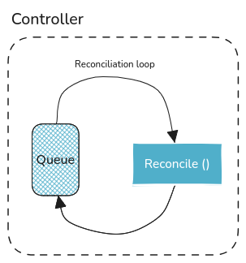
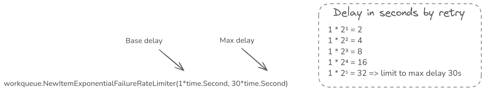
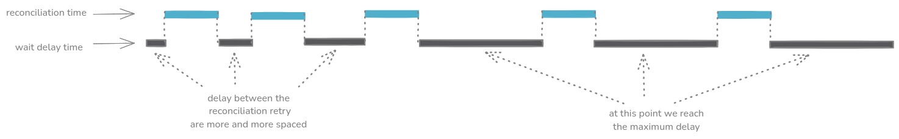
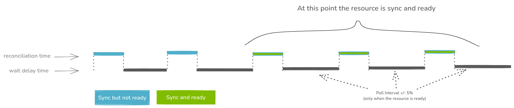
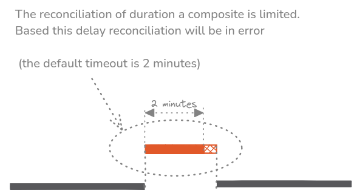
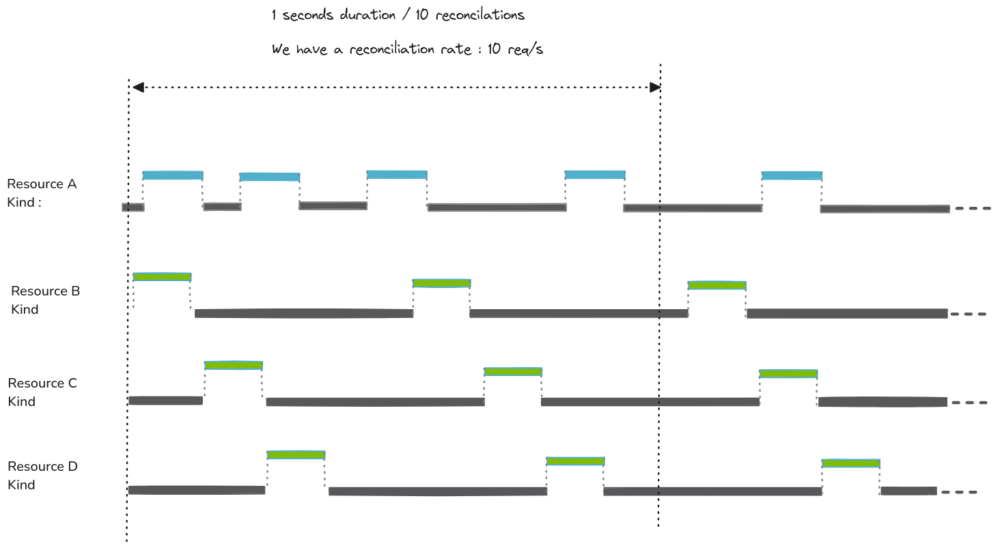
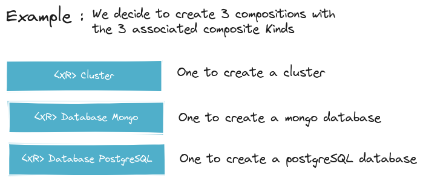
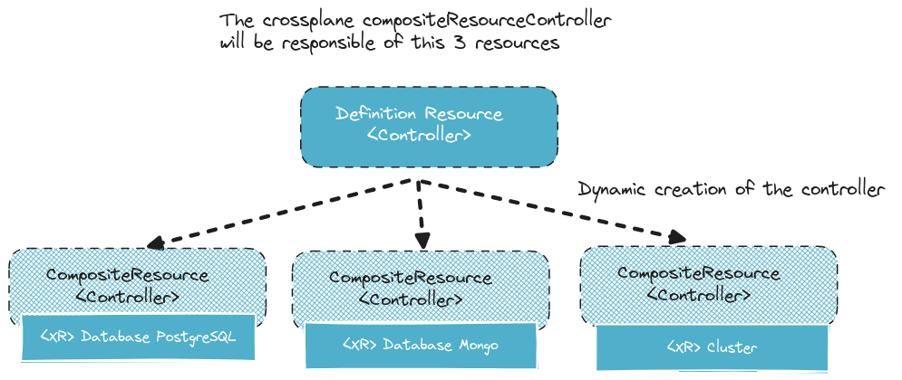
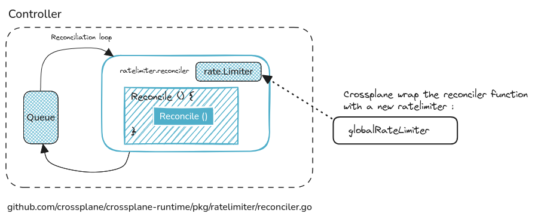
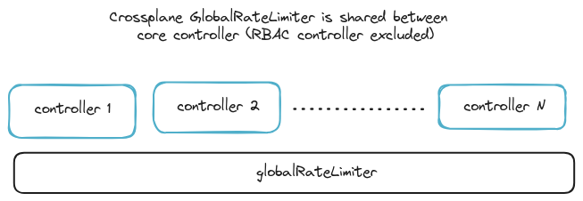

# Resource Times

In this article we will try to resume and explain the different time flow for a crossplane resource.

## Back to basics.. controller & reconcile

Before starting to explain the crossplane resource lifecycle, it's important to remind how the reconcilation work


A reconcile method is in charge to ensure that the exepected state is matching the real state.

To do this, this method is called in a loop (aka the reconciliation loop).




### Technical implementation

The crossplane controller used the standard kubernetes contoller present in the kubernetes golang **contoller-runtime** framework

```
sigs.k8s.io/controller-runtime/pkg/internal/controller/controller.go
```


The following code is an extraction (simplified for readibility) of the implementation [contoller.go](https://github.com/kubernetes-sigs/controller-runtime/blob/12cc8d59fabe3a1dbbd927ae6aea077cf7962267/pkg/internal/controller/controller.go#L310-L343)


```golang
	result, err := c.Reconcile(ctx, req)
	switch {
	case err != nil:
		if errors.Is(err, reconcile.TerminalError(nil)) {
			ctrlmetrics.TerminalReconcileErrors.WithLabelValues(c.Name).Inc()
		} else {
			c.Queue.AddRateLimited(req)
		}
		log.Error(err, "Reconciler error")

	case result.RequeueAfter > 0:
		log.V(5).Info(fmt.Sprintf("Reconcile done, requeueing after %s", result.RequeueAfter))
		
		// The result.RequeueAfter request will be lost, if it is returned
		// along with a non-nil error. But this is intended as
		// We need to drive to stable reconcile loops before queuing due
		// to result.RequestAfter
		c.Queue.Forget(obj)
		c.Queue.AddAfter(req, result.RequeueAfter)

	case result.Requeue:
		log.V(5).Info("Reconcile done, requeueing")
		c.Queue.AddRateLimited(req)
		// ....

	default:
		log.V(5).Info("Reconcile successful")
		// Finally, if no error occurs we Forget this item so it does not
		// get queued again until another change happens.
		c.Queue.Forget(obj)
		//...
	}
```

What we can observe it that the reconciliation loop deal with 4 cases : 

* case 1 : The reconciliation have finished **in error**. In this case, it's requeued using the rate limiter queue
* case 2 : The reconciliation have finish with a **requeue** after. 
* case 3 : The reconcilation have claim a requeue.  In this case we process to `exponentialBackOff` using the rate limiter queue
* case 4 : The reconcilication have finish and no need to reconciliate it later (so no check will be initiate by the controller, only  a change emit by kubernetes will provoke a reconciliation)


Note: The RateLimitedQueue is generally implemented using the **exponentialBackOff** queue explain later in this article 

 ## Exponential Backoff 


When a reconciliation doesn't reach the terminal state for the resource, crossplane decrease the rate where the reconciliation is retried

It's base one the Exponential follow algorith

* r : Number of retry
* basedelay : Initial base delay
* maxdelay: Max delay

delay = $\min(basedelay*2^r, maxdelay)$


So if we take the crossplane first iteration values, we obtain the following result




In the time graph we will observe something like this, with reconciliation more and more spaced until reach the max delay




## Poll-interval

Crossplane expose a parameter call the **poll-interval**.
This parameter let's you configure the time interval between each reconciliation **once the resource is ready**.

:warning: **Warning:** Notice that if you reconcilation is not succeeded (error or not reach the exepected state) this interval is not used





Default values is ```defaultPollInterval = 1 * time.Minute```


##  Reconcile timeout

The duration to reconcile a resource is limited to avoid infinite duraction.



Technically it's handle using the golang context timeout 


### Technical explaination


In order to implement exponential backoff, crossplane use the default rate limiter queue 

```
k8s.io/client-go/util/workqueue/default_rate_limiters.go
```


```golang
// ItemExponentialFailureRateLimiter does a simple baseDelay*2^<num-failures> limit
// dealing with max failures and expiration are up to the caller
func (r *ItemExponentialFailureRateLimiter) When(item interface{}) time.Duration {
	r.failuresLock.Lock()
	defer r.failuresLock.Unlock()

	exp := r.failures[item]
	r.failures[item] = r.failures[item] + 1

	// The backoff is capped such that 'calculated' value never overflows.
	backoff := float64(r.baseDelay.Nanoseconds()) * math.Pow(2, float64(exp))
	if backoff > math.MaxInt64 {
		return r.maxDelay
	}

	calculated := time.Duration(backoff)
	if calculated > r.maxDelay {
		return r.maxDelay
	}

	return calculated
}
```


## Max Reconcile Rate

The **max reconcile rate** parameter permit to limit the max reconciliation that can occured to 


`--max-reconcile-rate`




It could be nice to adjuste this parameter : 
 * According to the limitation of the API used by the external resource 


### Case of crossplane core-controller

Have a look to the composition controller init [code](https://github.com/crossplane/crossplane/blob/d27ffc21da430ca196fdbc707bd1c1482baad742/internal/controller/apiextensions/definition/reconciler.go#L472-L533)






Related: 
[crossplane-issue](https://github.com/crossplane/crossplane/issues/2595)


**Wrapper reconcilier**
[reconcile-wrapper](https://github.com/crossplane/crossplane/blob/d27ffc21da430ca196fdbc707bd1c1482baad742/internal/controller/apiextensions/definition/reconciler.go#L482)


//////////////////////////////////////
https://github.com/crossplane/crossplane/blob/76fdf072330959e526a3a2435321b6a08829212e/cmd/crossplane/core/core.go#L189

```golang
	o := controller.Options{
		Logger:                  log,
		MaxConcurrentReconciles: c.MaxReconcileRate,
		PollInterval:            c.PollInterval,
		GlobalRateLimiter:       ratelimiter.NewGlobal(c.MaxReconcileRate),
		Features:                &feature.Flags{},
	}
```





Global ratelimiter (crossplane implementation [code](https://github.com/crossplane/crossplane-runtime/blob/2d523674b5a01b1a92f974010cf55da0f6e36230/pkg/ratelimiter/default.go#L29-L34))
```golang
// NewGlobal returns a token bucket rate limiter meant for limiting the number
// of average total requeues per second for all controllers registered with a
// controller manager. The bucket size (i.e. allowed burst) is rps * 10.
func NewGlobal(rps int) *workqueue.BucketRateLimiter {
	return &workqueue.BucketRateLimiter{Limiter: rate.NewLimiter(rate.Limit(rps), rps*10)}
}
```



For the *MaxConcurentReconcile* willdetermine the number of concurrent reconcile. In the implementation, the native kubernetes controller lib will create a number off worker 
that match this value.  

Code extraction from [controller source code](https://github.com/kubernetes-sigs/controller-runtime/blob/0845967e302004e8dcfbe74fcef4437b4e31118e/pkg/internal/controller/controller.go#L215-L225)


sigs.k8s.io/controller-runtime/pkg/internal/controller/controller.go

```golang
		// Launch workers to process resources
		c.LogConstructor(nil).Info("Starting workers", "worker count", c.MaxConcurrentReconciles)
		wg.Add(c.MaxConcurrentReconciles)
		for i := 0; i < c.MaxConcurrentReconciles; i++ {
			go func() {
				defer wg.Done()
				// Run a worker thread that just dequeues items, processes them, and marks them done.
				// It enforces that the reconcileHandler is never invoked concurrently with the same object.
				for c.processNextWorkItem(ctx) {
				}
			}()
		}

```

//////////////////////////////////////


# TODO 

Explain the jitter


# References

https://github.com/crossplane/crossplane/issues/2595
https://pkg.go.dev/sigs.k8s.io/controller-runtime#section-readme